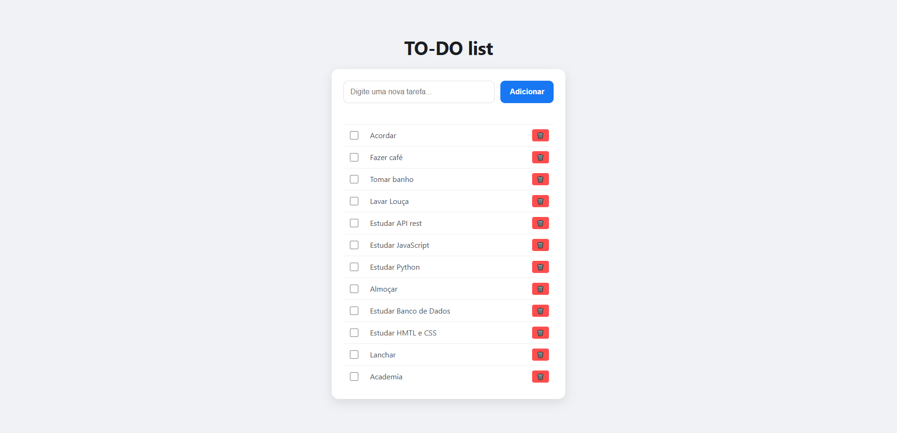

# 📝 To-Do List Full Stack

Este é um projeto de lista de tarefas completo, desenvolvido para consolidar conhecimentos em integração de sistemas, comunicação assíncrona com **Fetch API** e persistência de dados em banco de dados relacional.

O projeto utiliza uma arquitetura cliente-servidor, onde o Front-end em JavaScript consome uma API RESTful construída com Python e Flask, armazenando as informações em um banco MySQL.


## 📸 Demonstração do Projeto



*Legenda: Interface principal do sistema carregando tarefas do banco de dados.*


## 🛠️ Tecnologias Utilizadas

*   **Front-end**: HTML5, CSS3 e JavaScript Moderno (ES6+).
*   **Back-end**: Python 3.10+, Flask e Flask-CORS.
*   **Banco de Dados**: MySQL 8.0.
*   **Comunicação**: Fetch API (Métodos GET, POST e DELETE).


## 🚀 Funcionalidades

- [x] **Persistência de Dados**: As tarefas não somem ao recarregar a página (F5).
- [x] **Renderização Dinâmica**: O DOM é atualizado apenas após a confirmação do banco de dados.
- [x] **Setup Automático**: O script Python verifica e cria o banco de dados e as tabelas necessárias no primeiro `run`.
- [x] **Gerenciamento de Erros**: Tratamento de exceções tanto no servidor quanto no cliente (catch de erros de rede).
- [x] **Possibilidade** de excluir ou dar "Check" em cada tarefa


## 📂 Estrutura de Arquivos

- [x] **app.py**: Contém a API Flask, rotas REST e lógica de conexão com MySQL.
- [x] **script.js**: Gerencia as chamadas de API (fetch) e manipulação do DOM.
- [x] **index.html**: Estrutura semântica da aplicação.
- [x] **style.css**: Estilização moderna e responsiva.
- [x] **.gitignore**: Protege o repositório de arquivos desnecessários (__pycache__, venv, etc).


## 📋 Pré-requisitos

Antes de começar, você vai precisar ter instalado:
1. [Python 3.x](https://www.python.org/)
2. [MySQL Server](https://dev.mysql.com/downloads/installer/)
3. [Flask e Flask-cors](https://pypi.org/project/flask-cors/)


## 🔧 Configuração e Uso

### 1. Preparação do Ambiente
Instale as bibliotecas necessárias via terminal:
```bash
pip install flask flask-cors mysql-connector-python 
```

### 2. Configuração do Banco de Dados
No arquivo app.py, ajuste as credenciais de acesso dentro das funções de conexão:
```bash
# Exemplo de configuração
host="localhost",
user="seu_usuario",
password="sua_password"
```

### 3. Execução:
1. Inicie o servidor Backend:
```bash 
python app.py
``` 

2.Abra o arquivo **index.html** no seu navegador (recomendado usar a extensão Live Server).

### 👨‍💻 Autor
---
**João Pedro Rocha**, estudando de Ciência da Computação.